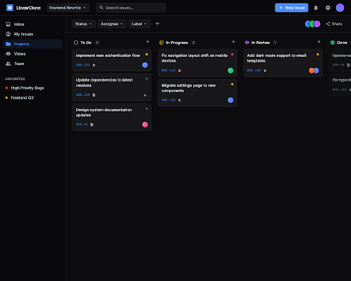
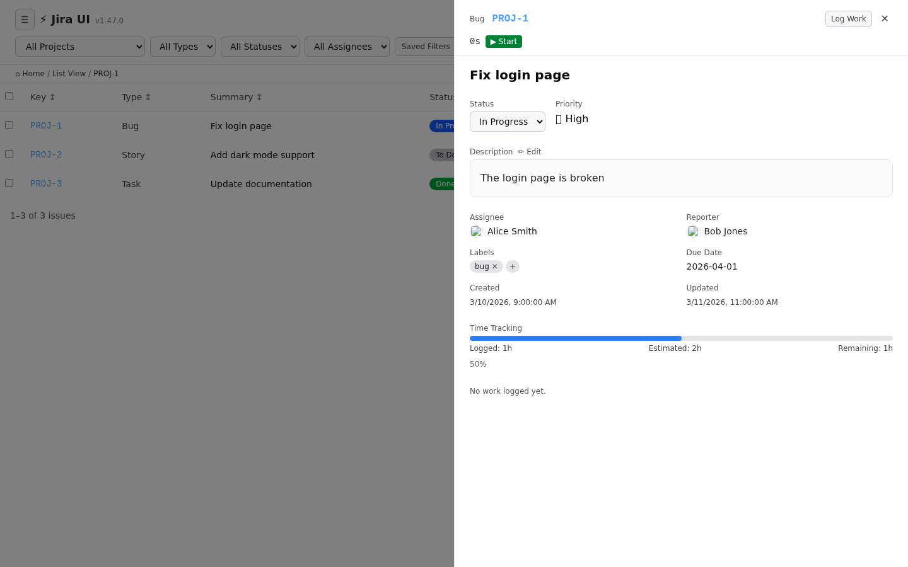
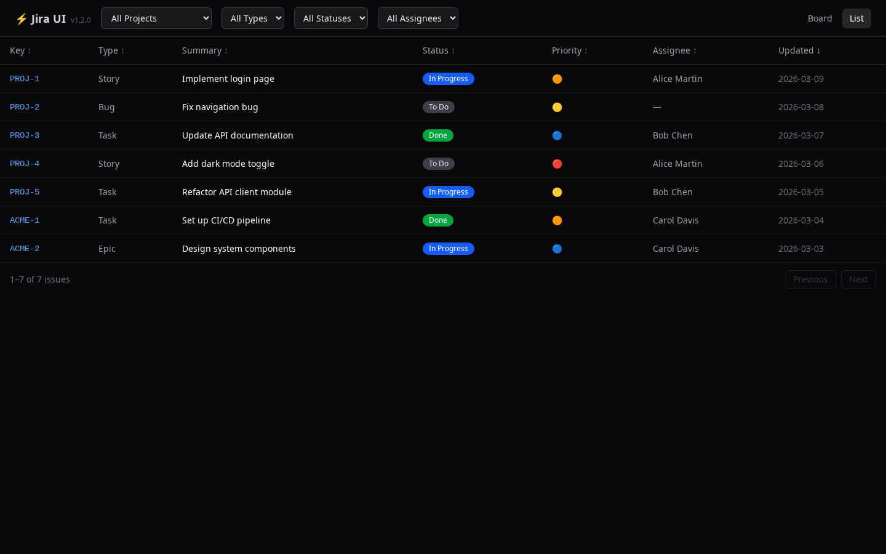
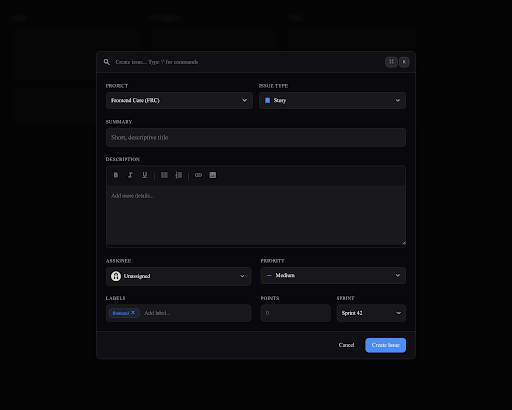

# atlassian-jira-ui

[](https://opensource.org/licenses/MIT)
[](https://www.python.org/)
[](https://react.dev/)
[](https://tailwindcss.com/)
[](https://github.com/ALT-F1-OpenClaw/atlassian-jira-ui/commits/main)
[](https://github.com/ALT-F1-OpenClaw/atlassian-jira-ui/issues)
[](https://github.com/ALT-F1-OpenClaw/atlassian-jira-ui/stargazers)

A modern, fast, and opinionated alternative UI for Atlassian Jira Cloud. Because Jira's UI sucks.

By [Abdelkrim BOUJRAF](https://www.alt-f1.be) / ALT-F1 SRL, Brussels 🇧🇪 🇲🇦

## Why?

Jira is powerful. Jira's UI is not. It's slow, cluttered, and fights you at every step.

**This project fixes that** — a clean, modern frontend that talks to Jira's REST API v3 through a Python backend.

## Architecture

```
┌─────────────────────────────────────────────┐
│                  Frontend                    │
│         React 19 + Tailwind CSS 4           │
│     Vite · TypeScript · Clean & Fast        │
├─────────────────────────────────────────────┤
│                  Backend                     │
│          Python · FastAPI · Async           │
│     Jira REST API v3 · Auth Proxy           │
├─────────────────────────────────────────────┤
│             Jira Cloud API v3               │
│          atlassian.net REST API             │
└─────────────────────────────────────────────┘
```

## Screenshots

### Kanban Board


### Issue Detail View


### List View


### Create Issue Modal


*UI designs generated with [Google Stitch](https://stitch.withgoogle.com/) — Gemini 3 Pro*

## What's Better

| Jira's UI | This UI |
|-----------|---------|
| 3-5s page loads | Instant (SPA + API caching) |
| Cluttered sidebars | Clean, focused views |
| Tiny text, wasted space | Readable, dense when needed |
| Confusing navigation | 3 views: Board, List, Detail |
| Search is broken | Fast fuzzy search + JQL |
| Can't see what matters | Priority-sorted, status-colored |

## Features (Planned)

### Phase 1 — Core Views
- [ ] **Board view** — Kanban with drag & drop transitions
- [ ] **List view** — Dense, sortable, filterable table
- [ ] **Issue detail** — Clean layout, inline editing
- [ ] **Quick search** — Fuzzy + JQL with autocomplete

### Phase 2 — Productivity
- [ ] **Keyboard shortcuts** — Vim-style navigation
- [ ] **Bulk actions** — Multi-select, bulk transition/assign
- [ ] **Quick create** — `Ctrl+K` → type → done
- [ ] **Saved filters** — Personal quick-access views

### Phase 3 — Power Features
- [ ] **Sprint dashboard** — Burndown, velocity, at a glance
- [ ] **Time tracking** — Built-in timer, log from board
- [ ] **Dark mode** — Because it's 2026
- [ ] **Offline mode** — Cache + sync when back online

## Tech Stack

### Backend (Python)
- **FastAPI** — async, fast, auto-documented
- **httpx** — async HTTP client for Jira API
- **Pydantic** — request/response validation
- **python-jose** — JWT session handling
- **uvicorn** — ASGI server

### Frontend (React)
- **React 19** — latest, with server components ready
- **Vite** — instant HMR, fast builds
- **TypeScript** — type safety
- **Tailwind CSS 4** — utility-first, clean
- **TanStack Query** — data fetching + caching
- **dnd-kit** — drag & drop for board
- **cmdk** — command palette
- **Vitest** — fast unit testing
- **Testing Library** — BDD-style component tests

## Quick Start

```bash
# Clone
git clone https://github.com/ALT-F1-OpenClaw/atlassian-jira-ui.git
cd atlassian-jira-ui

# Backend
cd backend
python -m venv .venv
source .venv/bin/activate
pip install -r requirements.txt
cp .env.example .env
# Edit .env with your Jira credentials
uvicorn app.main:app --reload --port 35400

# Frontend (new terminal)
cd frontend
npm install
cp .env.example .env
npm run dev
```

Open http://localhost:5173

## Setup

### Jira Credentials

1. Go to https://id.atlassian.com/manage-profile/security/api-tokens
2. Create an API token
3. Configure `.env`:

```env
JIRA_HOST=https://yourcompany.atlassian.net
JIRA_EMAIL=you@company.com
JIRA_API_TOKEN=your-api-token
```

### App Secret Key

Generate a secure random key for `APP_SECRET_KEY`:

```bash
python -c "import secrets; print(secrets.token_urlsafe(32))"
# or
openssl rand -base64 32
```

## Docker

### Prerequisites

- [Docker](https://docs.docker.com/get-docker/) and [Docker Compose](https://docs.docker.com/compose/install/) installed

### Run with Docker Compose

```bash
# 1. Configure your environment
cp backend/.env.example backend/.env
# Edit backend/.env with your Jira credentials and APP_SECRET_KEY

# 2. Build and start both services
docker compose up --build

# Or run in detached mode
docker compose up --build -d
```

- **Frontend** — <http://localhost:5173>
- **Backend API** — <http://localhost:35400>

### Manage containers

```bash
# Stop services
docker compose down

# View logs
docker compose logs -f

# Rebuild after code changes
docker compose up --build
```

### Run services individually

```bash
# Backend only
docker build -t jira-ui-backend ./backend
docker run -p 35400:35400 --env-file ./backend/.env jira-ui-backend

# Frontend only
docker build -t jira-ui-frontend ./frontend
docker run -p 5173:80 jira-ui-frontend
```

## Project Structure

```
atlassian-jira-ui/
├── backend/
│   ├── app/
│   │   ├── main.py              # FastAPI app + CORS
│   │   ├── config.py            # Settings via Pydantic
│   │   ├── jira_client.py       # Async Jira API wrapper
│   │   └── routers/
│   │       ├── issues.py        # Work package endpoints
│   │       ├── boards.py        # Board/sprint endpoints
│   │       ├── projects.py      # Project endpoints
│   │       └── search.py        # Search + JQL
│   ├── requirements.txt
│   ├── .env.example
│   └── Dockerfile
├── frontend/
│   ├── src/
│   │   ├── App.tsx
│   │   ├── components/
│   │   │   ├── Board/           # Kanban board
│   │   │   ├── List/            # Table view
│   │   │   ├── Detail/          # Issue detail
│   │   │   ├── Search/          # Command palette
│   │   │   └── Layout/          # Shell, nav, sidebar
│   │   ├── hooks/               # API hooks (TanStack Query)
│   │   ├── stores/              # State management
│   │   └── types/               # TypeScript types
│   ├── package.json
│   ├── vite.config.ts
│   ├── tailwind.config.ts
│   ├── .env.example
│   └── Dockerfile
├── docker-compose.yml
├── LICENSE
└── README.md
```

## API Endpoints (Backend)

| Method | Endpoint | Description |
|--------|----------|-------------|
| GET | `/api/projects` | List projects |
| GET | `/api/projects/{key}` | Project details |
| GET | `/api/issues` | List/filter issues |
| GET | `/api/issues/{key}` | Issue detail |
| POST | `/api/issues` | Create issue |
| PATCH | `/api/issues/{key}` | Update issue |
| POST | `/api/issues/{key}/transition` | Transition issue |
| GET | `/api/boards/{id}` | Board with columns |
| GET | `/api/boards/{id}/sprint` | Active sprint |
| GET | `/api/search` | JQL search |
| GET | `/api/search/quick` | Fuzzy text search |

## Testing

```bash
cd frontend

# Run all tests once
npm test

# Run tests in watch mode (re-runs on file changes)
npm run test:watch
```

Tests use [Vitest](https://vitest.dev/) + [Testing Library](https://testing-library.com/) with BDD-style scenarios (`describe`/`it` blocks following Given/When/Then).

### Test structure

```text
frontend/src/
├── App.test.tsx              # List view BDD tests
├── test/
│   └── setup.ts              # Testing Library + jest-dom setup
└── vitest.config.ts          # Vitest configuration
```

## Releasing a New Version

```bash
# Install dependencies (first time only)
npm install

# Bump version (updates all sources + generates CHANGELOG + commits + tags)
node scripts/bump-version.mjs patch   # 1.0.0 → 1.0.1
node scripts/bump-version.mjs minor   # 1.0.0 → 1.1.0
node scripts/bump-version.mjs major   # 1.0.0 → 2.0.0
node scripts/bump-version.mjs 2.5.0   # explicit version

# Push to remote
git push && git push --tags
```

The bump script updates the version in:

- `package.json` (root)
- `frontend/package.json`
- `backend/app/version.py`
- `CHANGELOG.md` (auto-generated from conventional commits)

## Security

- API token never sent to frontend — backend acts as proxy
- CORS restricted to frontend origin
- No credentials stored in browser
- Rate limiting with exponential backoff
- Session-based auth for multi-user deployment

## License

MIT — see [LICENSE](./LICENSE)

## Author

Abdelkrim BOUJRAF — [ALT-F1 SRL](https://www.alt-f1.be), Brussels 🇧🇪 🇲🇦
- GitHub: [@abdelkrim](https://github.com/abdelkrim)
- X: [@altf1be](https://x.com/altf1be)

## Contributing

Contributions welcome! This is an opinionated project — if you also think Jira's UI sucks, you're in the right place.
