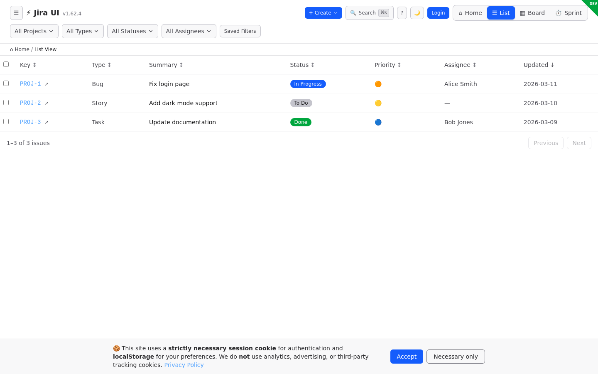
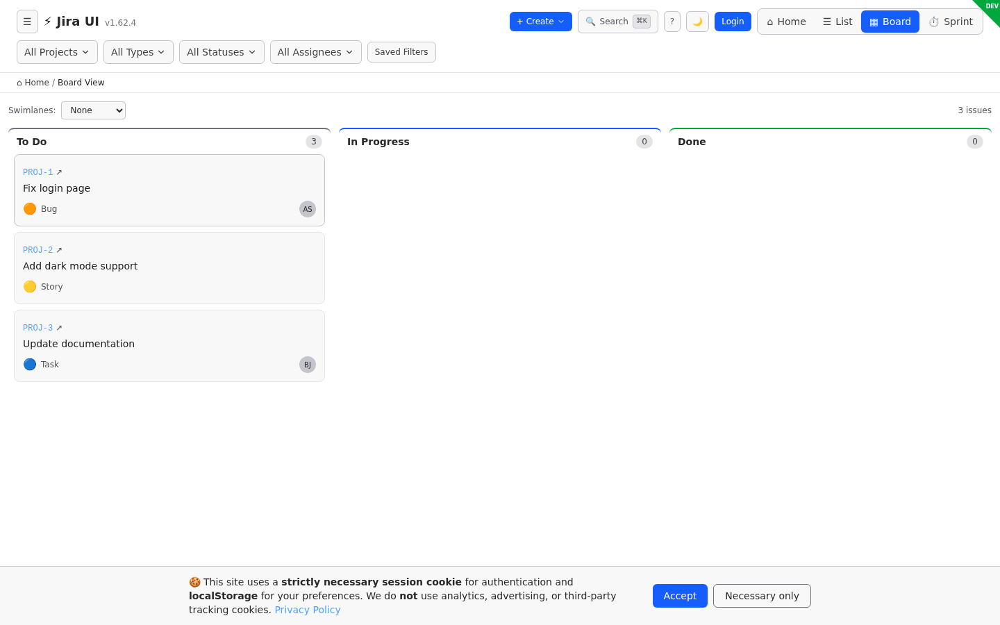
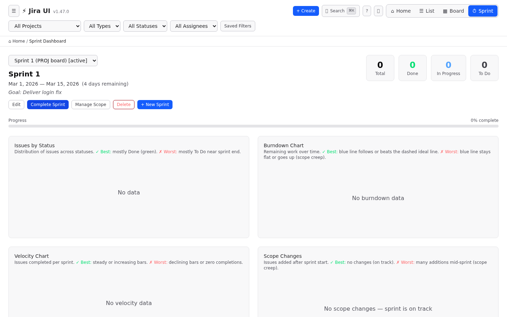
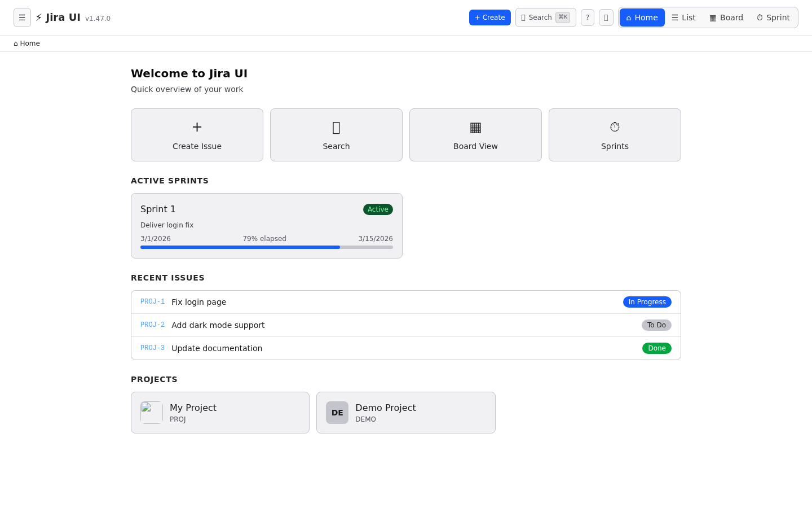
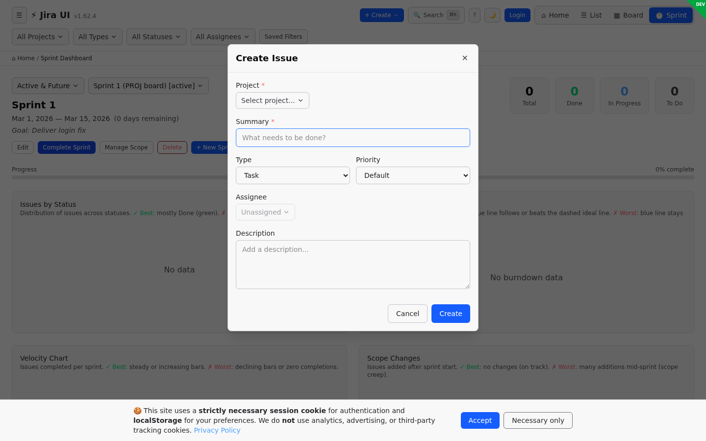
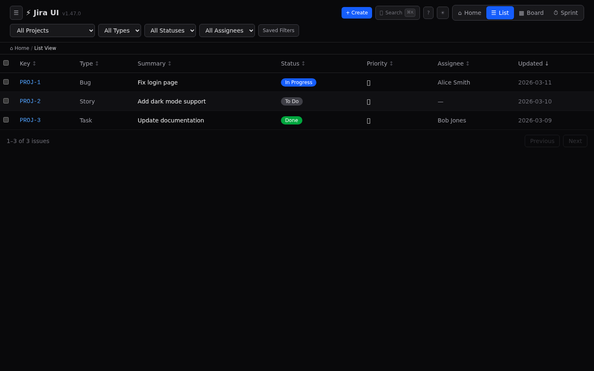
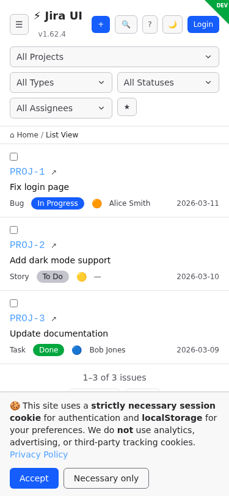
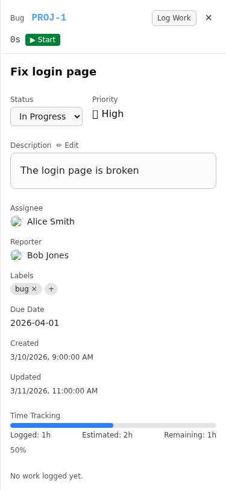
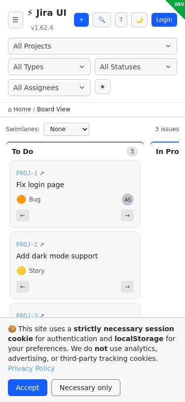

# atlassian-jira-ui

[](https://github.com/ALT-F1-OpenClaw/atlassian-jira-ui/actions/workflows/ci.yml)
[](https://github.com/ALT-F1-OpenClaw/atlassian-jira-ui/actions/workflows/release.yml)
[](https://github.com/ALT-F1-OpenClaw/atlassian-jira-ui/actions/workflows/docker.yml)
[](https://github.com/ALT-F1-OpenClaw/atlassian-jira-ui/releases/latest)
[](https://opensource.org/licenses/MIT)
[](https://www.python.org/)
[](https://react.dev/)
[](https://tailwindcss.com/)
[](https://github.com/ALT-F1-OpenClaw/atlassian-jira-ui/commits/main)
[](https://github.com/ALT-F1-OpenClaw/atlassian-jira-ui/issues)
[](https://github.com/ALT-F1-OpenClaw/atlassian-jira-ui/stargazers)

A modern, fast, and opinionated alternative UI for Atlassian Jira Cloud. Because Jira's UI deserves better.

By [Abdelkrim BOUJRAF](https://www.alt-f1.be) / ALT-F1 SRL, Brussels 🇧🇪 🇲🇦

## Why?

Jira is powerful. Jira's UI is not. It's slow, cluttered, and fights you at every step.

**This project fixes that** — a clean, modern frontend that talks to Jira's REST API v3 through a Python backend.

## Architecture

```
┌─────────────────────────────────────────────┐
│                  Frontend                    │
│         React 19 + Tailwind CSS 4           │
│     Vite · TypeScript · Clean & Fast        │
├─────────────────────────────────────────────┤
│                  Backend                     │
│          Python · FastAPI · Async           │
│     Jira REST API v3 · Auth Proxy           │
├─────────────────────────────────────────────┤
│             Jira Cloud API v3               │
│          atlassian.net REST API             │
└─────────────────────────────────────────────┘
```

## CI/CD Pipeline

```
  ┌──────────────┐
  │   git push   │
  │   to main    │
  └──────┬───────┘
         │
         ▼
  ┌──────────────────────────────────────────────────────────────┐
  │                        CI Workflow                           │
  │                  (.github/workflows/ci.yml)                  │
  │                                                              │
  │  ┌─────────────────────┐    ┌──────────────────────────┐    │
  │  │  Frontend (Node 20) │    │  Backend (Python 3.11)   │    │
  │  │  Frontend (Node 22) │    │  Backend (Python 3.12)   │    │
  │  │                     │    │  Backend (Python 3.13)   │    │
  │  │  • npm ci           │    │                          │    │
  │  │  • tsc --noEmit     │    │  • pip install           │    │
  │  │  • vitest (255)     │    │  • pytest (25)           │    │
  │  │  • vite build       │    │  • import verification   │    │
  │  └─────────┬───────────┘    └────────────┬─────────────┘    │
  │            │                              │                  │
  └────────────┼──────────────────────────────┼──────────────────┘
               │                              │
               ▼                              ▼
        ┌──────────┐                  ┌──────────────┐
        │  PASS ✅  │                  │   FAIL ❌     │
        └──────┬───┘                  └──────┬───────┘
               │                              │
               │                              ▼
               │                 ┌────────────────────────┐
               │                 │  CI Auto-Fix Workflow   │
               │                 │  (ci-autofix.yml)       │
               │                 │                         │
               │                 │  • Extract failed logs  │
               │                 │  • Categorize error     │
               │                 │  • Create GitHub issue  │
               │                 │  • Notify Discord       │
               │                 └────────────────────────┘
               │
        ┌──────┴──────────────────────────┐
        │         git push --tags         │
        │           (v1.x.x)              │
        └──────┬──────────────────────────┘
               │
      ┌────────┼────────────────────┐
      ▼        ▼                    ▼
┌───────────┐ ┌──────────┐  ┌────────────────────┐
│  Release  │ │  Docker  │  │  Publish Docker    │
│ Workflow  │ │ Validate │  │  (GHCR)            │
│           │ │          │  │                    │
│ • Create  │ │ • Build  │  │ • Multi-arch       │
│   GitHub  │ │   check  │  │   amd64 + arm64    │
│   release │ │ • Compose│  │ • Push to GHCR     │
│ • Upload  │ │   verify │  │ • Tag: latest,     │
│   assets  │ │          │  │   1.x.0, 1.x       │
└───────────┘ └──────────┘  └────────────────────┘

  ┌──────────────────────────────────────────────────────────┐
  │                    Always Running                        │
  │                                                          │
  │  ┌─────────────┐    ┌──────────────┐                    │
  │  │   CodeQL     │    │  Dependabot  │                    │
  │  │  (weekly)    │    │  (weekly)    │                    │
  │  │              │    │              │                    │
  │  │  • JS/TS     │    │  • npm deps  │                    │
  │  │    analysis  │    │  • pip deps  │                    │
  │  │  • Python    │    │  • Actions   │                    │
  │  │    analysis  │    │    versions  │                    │
  │  └─────────────┘    └──────────────┘                    │
  └──────────────────────────────────────────────────────────┘
```

**Error categories detected by CI Auto-Fix:**

| Category | Trigger Pattern | Example |
|----------|----------------|---------|
| `test-runner-conflict` | Playwright specs in Vitest | Vitest importing `@playwright/test` |
| `missing-module` | Cannot find module | Deleted/moved import |
| `typescript-error` | TS error codes (TS2xxx) | Type mismatch |
| `test-failure` | Assertion errors | Failed expect() |
| `dependency-error` | npm/pip install errors | Version conflict |
| `lint-error` | ESLint/Prettier issues | Code style |
| `build-error` | Vite/Rollup failure | Bad import/config |

## Screenshots

> Auto-generated by Playwright with mock data — see all 17 in [APP_SCREENSHOTS.md](docs/APP_SCREENSHOTS.md)

### Issue List


### Issue Detail


### Kanban Board


### Sprint Dashboard


### Dashboard


### Create Issue


### Light Mode


### Mobile Views
| List | Detail | Board |
|------|--------|-------|
|  |  |  |

## What's Better

| Jira's UI | This UI |
|-----------|---------|
| 3-5s page loads | Instant (SPA + API caching) |
| Cluttered sidebars | Clean, focused views |
| Tiny text, wasted space | Readable, dense when needed |
| Confusing navigation | Dashboard, Board, List, Sprint views + sidebar |
| Search is broken | Fast fuzzy search + JQL |
| Can't see what matters | Priority-sorted, status-colored |

## Features

### Phase 1 — Core Views (Complete)
- [x] **List view** — Dense, sortable, filterable table with column sorting, filter dropdowns (type/status/assignee), pagination
- [x] **Issue detail panel** — Slide-in side panel with ADF rendering, inline editing (summary, description, assignee, priority, status, due date, labels), status transitions
- [x] **Board view / Kanban** — Columns by status category, issue cards, drag-and-drop transitions, swimlanes (assignee/priority)
- [x] **Command palette** — `Ctrl+K`/`Cmd+K` overlay, debounced fuzzy search, arrow key navigation, recent searches in localStorage

### Phase 2 — Productivity (Complete)
- [x] **Keyboard shortcuts** — `j`/`k` list navigation, `Enter` opens issue, `Escape` closes panels, `b`/`l` view switching, `?` help overlay, context-aware (disabled in inputs)
- [x] **Quick create** — `c` key or `+ Create` button, project/summary/type/priority/assignee/description fields, form validation, optimistic UI update
- [x] **Bulk actions** — Checkbox selection, select all/deselect all, floating action bar with bulk transition/assign/priority, batch API calls via `Promise.allSettled`
- [x] **Saved filters** — Save filter combinations as named views, quick-access dropdown, inline rename/delete, localStorage persistence

### Phase 3 — Power Features (In Progress)
- [x] **Sprint dashboard** — Active sprint overview, burndown chart, velocity chart, scope change tracking
- [x] **Sprint CRUD** — Create/edit/delete sprints, start/complete with confirmation dialogs, manage sprint scope (add/remove issues)
- [x] **Time tracking** — Built-in timer per issue, log work modal, progress bar, worklog history
- [x] **Dark/Light mode** — Toggle in header (sun/moon), CSS variable theme switching, localStorage persistence, system preference detection
- [x] **Offline mode** — Service worker caching, IndexedDB mutation queue, auto-sync on reconnect, offline indicator
- [x] **UI navigation** — Segmented view switcher with icons, collapsible sidebar (projects/filters/views), breadcrumbs, dashboard landing page, empty states with CTAs

### Additional Features
- **Searchable dropdowns** — Type-to-filter autocomplete on all dropdowns (project, filters, assignee, priority)
- **Create submenu** — `+ Create` dropdown with Issue and Project creation
- **Create project** — Name, auto-generated key, type (Software/Service Desk/Business), lead, description
- **Responsive design** — Mobile-first layout, stacked filters, adaptive pagination, works on phone/tablet/desktop
- **Rich text editor** — TipTap-based ADF editor with toolbar (bold, italic, headings, lists, links, code blocks)
- **Smart dropdowns** — Assignee from Jira project members, priority from Jira API, status transitions
- **Date picker** — Native date widget for due date (add/clear)
- **Editable labels** — Add/remove with autocomplete from Jira labels
- **Mobile Kanban arrows** — Arrow buttons on cards for status transitions (mobile only)
- **PWA** — Web app manifest, service worker, installable on mobile
- **302 tests** — 255 Vitest BDD + 25 pytest backend + 22 Playwright E2E

## Tech Stack

### Backend (Python)
- **FastAPI** — async, fast, auto-documented
- **httpx** — async HTTP client for Jira API
- **Pydantic** — request/response validation
- **python-jose** — JWT session handling
- **uvicorn** — ASGI server

### Frontend (React)
- **React 19** — latest, with server components ready
- **Vite 6** — instant HMR, fast builds
- **TypeScript 5.7** (strict) — type safety
- **Tailwind CSS 4** — utility-first, clean
- **TanStack Query** — data fetching + caching
- **TipTap** — rich text editor for ADF descriptions
- **dnd-kit** — drag & drop for board
- **cmdk** — command palette
- **Vitest** — fast unit testing
- **Testing Library** — BDD-style component tests (248 scenarios)

## Deployment

The app runs on a Raspberry Pi 4 (ARM64) with Docker + Traefik, accessible via Tailscale.

```
┌──────────────────────────────────────────────────────┐
│                   Raspberry Pi 4                      │
│                                                       │
│  ┌─────────┐  ┌───────────┐                          │
│  │ Traefik │  │Watchtower │                          │
│  │  :4443  │  │  5 min    │                          │
│  │  :9443  │  │  poll     │                          │
│  └────┬────┘  └───────────┘                          │
│       │                                               │
│  ┌────┴──────────────────┐  ┌──────────────────────┐ │
│  │   DEV (:9443)         │  │   PROD (:4443)       │ │
│  │  :latest (auto)       │  │  pinned version      │ │
│  └───────────────────────┘  └──────────────────────┘ │
└──────────────────────────────────────────────────────┘
```

| Environment | URL | Update |
|---|---|---|
| **Prod** | `https://atlf1be-raspberry-pi-4.tail981e59.ts.net:4443` | Manual: `./deploy-prod.sh vX.Y.Z` |
| **Dev** | `https://atlf1be-raspberry-pi-4.tail981e59.ts.net:9443` | Auto (Watchtower, 5 min) |

**6 containers**: Traefik (reverse proxy + TLS), Watchtower (auto-update dev), prod-backend, prod-frontend, dev-backend, dev-frontend.

📖 **[User Guide](docs/USER_GUIDE.md)** — full feature documentation
🚀 **[Deployment Guide](deploy/README.md)** — production setup on Raspberry Pi

## Getting Started

### Prerequisites

- A [Jira Cloud](https://www.atlassian.com/software/jira) account
- An [API token](https://id.atlassian.com/manage-profile/security/api-tokens) for your Jira account
- [Docker](https://docs.docker.com/get-docker/) and [Docker Compose](https://docs.docker.com/compose/install/) installed

### 🚀 Quick Start (Docker — recommended)

Run in **3 steps**, no build required. Pre-built multi-arch images (amd64 + arm64) from GitHub Container Registry:

```bash
# 1. Download the compose file
curl -O https://raw.githubusercontent.com/ALT-F1-OpenClaw/atlassian-jira-ui/main/docker-compose.ghcr.yml

# 2. Create your credentials file
mkdir -p backend
cat > backend/.env << EOF
JIRA_HOST=https://yourcompany.atlassian.net
JIRA_EMAIL=you@company.com
JIRA_API_TOKEN=your-api-token-here
APP_SECRET_KEY=$(openssl rand -base64 32)
EOF

# 3. Start
docker compose -f docker-compose.ghcr.yml up -d
```

Open **http://localhost:5173** — done! 🎉

Images:
- `ghcr.io/alt-f1-openclaw/atlassian-jira-ui-backend:latest`
- `ghcr.io/alt-f1-openclaw/atlassian-jira-ui-frontend:latest`

Pinned versions also available (e.g. `:1.40.0`, `:1.40`).

### Alternative: Build from source (Docker)

```bash
git clone https://github.com/ALT-F1-OpenClaw/atlassian-jira-ui.git
cd atlassian-jira-ui
cp backend/.env.example backend/.env
# Edit backend/.env with your Jira credentials
docker compose up --build -d
```

### Alternative: Local development (no Docker)

```bash
git clone https://github.com/ALT-F1-OpenClaw/atlassian-jira-ui.git
cd atlassian-jira-ui

# Backend
cd backend
python -m venv .venv && source .venv/bin/activate
pip install -r requirements.txt
cp .env.example .env   # Edit with your Jira credentials
uvicorn app.main:app --reload --port 35400

# Frontend (new terminal)
cd frontend
npm install
npm run dev
```

Open http://localhost:5173

### Access

- **Frontend** — <http://localhost:5173>
- **Backend API** — <http://localhost:35400>
- **API docs** — <http://localhost:35400/docs> (FastAPI auto-generated)

### Manage containers

```bash
docker compose down           # Stop
docker compose logs -f        # Logs
docker compose up --build     # Rebuild after code changes
```

### Jira Credentials

| Variable | Description | Example |
|----------|-------------|---------|
| `JIRA_HOST` | Your Jira Cloud URL | `https://yourcompany.atlassian.net` |
| `JIRA_EMAIL` | Your Jira account email | `you@company.com` |
| `JIRA_API_TOKEN` | [API token](https://id.atlassian.com/manage-profile/security/api-tokens) | `ABCdef123...` |
| `APP_SECRET_KEY` | Random secret for sessions | `openssl rand -base64 32` |

## Project Structure

```
atlassian-jira-ui/
├── backend/
│   ├── app/
│   │   ├── main.py              # FastAPI app + CORS
│   │   ├── config.py            # Settings via Pydantic
│   │   ├── jira_client.py       # Async Jira API wrapper
│   │   ├── version.py           # Single version source
│   │   └── routers/
│   │       ├── issues.py        # Issue CRUD + transitions
│   │       ├── boards.py        # Board/sprint endpoints
│   │       ├── projects.py      # Projects + members
│   │       ├── search.py        # Search + JQL
│   │       ├── priorities.py    # Jira priorities
│   │       ├── labels.py        # Jira labels
│   │       └── sprints.py       # Sprint data + burndown
│   ├── requirements.txt
│   ├── .env.example
│   └── Dockerfile
├── frontend/
│   ├── src/
│   │   ├── App.tsx              # Single-file UI (all views)
│   │   └── App.test.tsx         # 248 BDD test scenarios
│   ├── package.json
│   ├── vite.config.ts
│   ├── .env.example
│   └── Dockerfile
├── frontend/
│   ├── e2e/
│   │   ├── app.spec.ts          # 22 E2E test scenarios
│   │   ├── screenshots.spec.ts  # 17 auto-generated screenshots
│   │   └── fixtures.ts          # Mock data + mockAllApiRoutes()
│   └── playwright.config.ts     # Playwright config (Chromium, port 4173)
├── scripts/
│   └── bump-version.mjs         # Version sync + changelog
├── deploy/
│   ├── README.md                # Production deployment guide
│   ├── docker-compose.yml       # 6-container setup (Traefik + dev + prod)
│   ├── deploy-prod.sh           # Pin prod to specific version tag
│   ├── traefik/                 # Traefik static + dynamic config
│   └── nginx.conf.template      # Per-environment nginx template
├── .github/
│   └── workflows/
│       ├── ci.yml               # Unit + backend tests (Node 20/22, Python 3.11-3.13)
│       ├── ci-autofix.yml       # Auto-diagnose CI failures → create issue
│       ├── codeql.yml           # Weekly security scanning
│       ├── docker.yml           # Docker compose validation
│       ├── publish-docker.yml   # Multi-arch GHCR publish on tag
│       └── release.yml          # GitHub release on tag
├── docker-compose.yml
├── docker-compose.ghcr.yml      # Pull pre-built images from GHCR
├── LICENSE
└── README.md
```

## API Endpoints (Backend)

| Method | Endpoint | Description |
|--------|----------|-------------|
| GET | `/api/projects` | List projects |
| POST | `/api/projects` | Create project (name, key, type, lead, description) |
| GET | `/api/projects/{key}` | Project details |
| GET | `/api/projects/{key}/members` | Project members (assignable users) |
| GET | `/api/issues` | List/filter issues |
| GET | `/api/issues/{key}` | Issue detail |
| POST | `/api/issues` | Create issue |
| PATCH | `/api/issues/{key}` | Update issue |
| POST | `/api/issues/{key}/transition` | Transition issue |
| GET | `/api/boards` | List boards |
| GET | `/api/boards/{id}` | Board with columns |
| GET | `/api/boards/{id}/sprint` | Active sprint |
| GET | `/api/priorities` | List Jira priorities |
| GET | `/api/labels` | List Jira labels |
| GET | `/api/sprints` | List boards with sprints (supports `state` param) |
| POST | `/api/sprints` | Create a new sprint |
| PATCH | `/api/sprints/{id}` | Update sprint name, goal, dates |
| DELETE | `/api/sprints/{id}` | Delete a sprint |
| POST | `/api/sprints/{id}/start` | Start a sprint |
| POST | `/api/sprints/{id}/complete` | Complete a sprint |
| GET | `/api/sprints/{id}/issues` | Sprint issues with status counts |
| POST | `/api/sprints/{id}/issues` | Add issues to a sprint |
| DELETE | `/api/sprints/{id}/issues/{key}` | Remove issue from sprint |
| GET | `/api/sprints/{id}/burndown` | Sprint burndown data |
| GET | `/api/sprints/{id}/velocity` | Velocity (points per sprint) |
| GET | `/api/search` | JQL search |
| GET | `/api/search/quick` | Fuzzy text search |

## Testing

```bash
cd frontend

# Run all tests once
npm test

# Run tests in watch mode (re-runs on file changes)
npm run test:watch
```

**302 total tests** across 3 test suites:

| Suite | Count | Framework | Location |
|-------|-------|-----------|----------|
| Frontend unit | 255 | Vitest + Testing Library | `frontend/src/App.test.tsx` |
| Backend API | 25 | pytest + pytest-asyncio | `backend/tests/` |
| E2E integration | 22 | Playwright (Chromium) | `frontend/e2e/app.spec.ts` |

All tests use BDD naming (`Given ... when ... then ...`). E2E tests mock all API routes — no real Jira calls.

```bash
# Run all tests
cd frontend && npm test          # 255 unit tests (vitest)
cd backend && python -m pytest tests/ -v   # 25 backend tests
cd frontend && npm run build && npx playwright test  # 22 E2E tests
```

### Auto-generated screenshots

17 screenshots captured by `frontend/e2e/screenshots.spec.ts` using mock data.
See [APP_SCREENSHOTS.md](docs/APP_SCREENSHOTS.md) for the full gallery.

## Releasing a New Version

```bash
# Install dependencies (first time only)
npm install

# Bump version (updates all sources + generates CHANGELOG + commits + tags)
node scripts/bump-version.mjs patch   # 1.0.0 → 1.0.1
node scripts/bump-version.mjs minor   # 1.0.0 → 1.1.0
node scripts/bump-version.mjs major   # 1.0.0 → 2.0.0
node scripts/bump-version.mjs 2.5.0   # explicit version

# Push to remote
git push && git push --tags
```

The bump script updates the version in:

- `package.json` (root)
- `frontend/package.json`
- `backend/app/version.py`
- `CHANGELOG.md` (auto-generated from conventional commits)

## Security

- API token never sent to frontend — backend acts as proxy
- CORS restricted to frontend origin
- No credentials stored in browser
- Rate limiting with exponential backoff
- Session-based auth for multi-user deployment

## References

- [Jira REST API v3 Documentation](https://developer.atlassian.com/cloud/jira/platform/rest/v3/intro/)
- [Jira Agile REST API](https://developer.atlassian.com/cloud/jira/software/rest/intro/)
- [Atlassian API Tokens](https://id.atlassian.com/manage-profile/security/api-tokens)

## License

MIT — see [LICENSE](./LICENSE)

## Author

Abdelkrim BOUJRAF — [ALT-F1 SRL](https://www.alt-f1.be), Brussels 🇧🇪 🇲🇦
- GitHub: [@abdelkrim](https://github.com/abdelkrim)
- X: [@altf1be](https://x.com/altf1be)

## Contributing

Contributions welcome! This is an opinionated project — if you also think Jira's UI could be faster and cleaner, you're in the right place.
