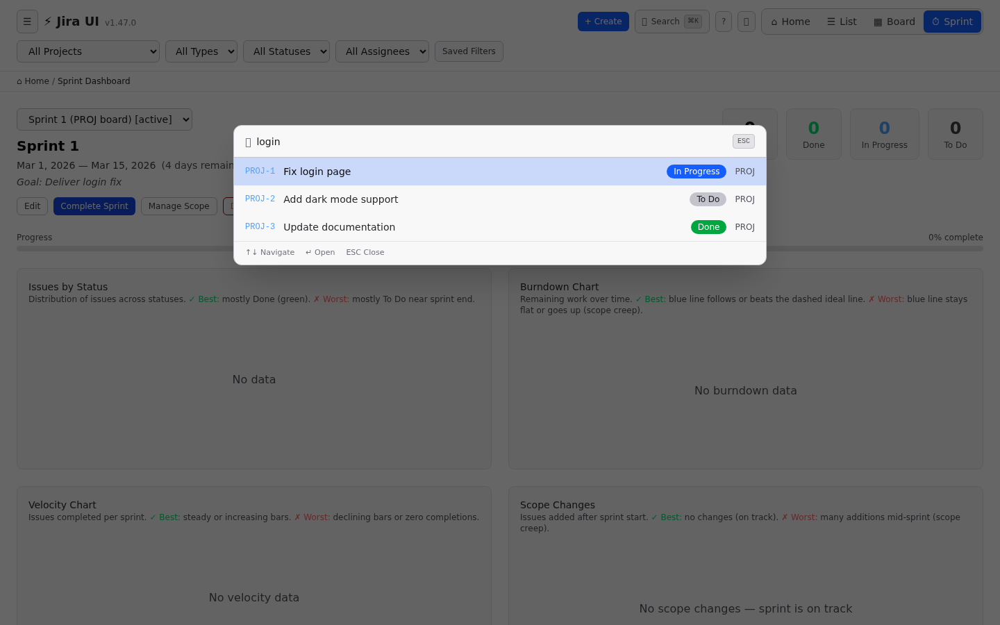

# Taskara

[](https://github.com/ALT-F1-OpenClaw/atlassian-jira-ui/actions/workflows/ci.yml)
[](https://github.com/ALT-F1-OpenClaw/atlassian-jira-ui/releases/latest)
[](https://opensource.org/licenses/MIT)
[](https://github.com/ALT-F1-OpenClaw/atlassian-jira-ui/stargazers)

**A faster, modern UI for Jira Cloud.** Because Jira's UI deserves better.

By [Abdelkrim BOUJRAF](https://github.com/Abdelkrim) / [ALT-F1 SRL](https://www.alt-f1.be), Brussels 🇧🇪 🇲🇦

> **Not affiliated with Atlassian.** Taskara is an independent, open-source project that uses Jira's public REST APIs. "Jira" is a registered trademark of Atlassian.

---

# For Users

## Why Taskara?

| Jira's UI | Taskara |
|-----------|---------|
| 3-5s page loads | Instant (SPA + smart caching) |
| Cluttered sidebars | Clean, focused views |
| Confusing navigation | Dashboard · List · Board · Sprint views |
| No useful keyboard shortcuts | `Ctrl+K` search, `j/k` navigation, `c` create |
| Sprint charts buried in menus | Burndown + velocity charts on one page |
| No offline support | Works offline with auto-sync |

## Screenshots

> Auto-generated with mock data — see all 17 in [APP_SCREENSHOTS.md](docs/APP_SCREENSHOTS.md)

| Dashboard | Kanban Board |
|-----------|-------------|
|  |  |

| Sprint Dashboard | Command Palette |
|-----------------|----------------|
|  |  |

| Issue Detail | Light Mode |
|-------------|------------|
|  |  |

| Mobile List | Mobile Board |
|------------|-------------|
|  |  |

## Features

### Views
- **Dashboard** — quick overview: active sprints, recent issues, project cards
- **List view** — sortable, filterable table with pagination
- **Kanban board** — drag-and-drop status transitions, swimlanes by assignee/priority
- **Sprint dashboard** — burndown chart, velocity chart, scope tracking, issue counts
- **Issue detail** — slide-in panel with ADF rendering, inline editing, status transitions

### Productivity
- **⌨️ Keyboard shortcuts** — `j/k` navigate, `Enter` open, `Escape` close, `b/l/s` switch views, `c` create, `?` help
- **🔍 Command palette** — `Ctrl+K` instant fuzzy search across all issues
- **⚡ Bulk actions** — select multiple issues, bulk transition/assign/priority
- **💾 Saved filters** — save filter combinations as named views
- **⏱️ Time tracking** — built-in timer, log work modal, progress bar
- **📝 Rich text editor** — TipTap editor for descriptions (bold, italic, headings, lists, links, code)

### Quality of Life
- **🌙 Dark/Light mode** — toggle in header, system preference detection
- **📱 Responsive** — mobile-first, works on phone/tablet/desktop
- **📴 Offline mode** — works without internet, auto-syncs when reconnected
- **🔔 Sprint state filter** — view Active, Future, Closed, or All sprints
- **📋 Create submenu** — quick-create issues and projects from anywhere

### Security & Privacy
- **🔐 OAuth 2.0** — "Login with Atlassian", no passwords stored
- **🚫 No data stored** — your Jira content stays in your browser, never on our servers
- **🔒 Encrypted tokens** — OAuth tokens encrypted at rest (Fernet/AES-128-CBC)
- **🛡️ Session protection** — fingerprinting prevents stolen cookie reuse
- **📊 Rate limiting** — per-IP limits protect your Jira API quota
- **🇪🇺 GDPR compliant** — Privacy Policy, Terms of Service, cookie consent

## Try It

### Option 1: Hosted (SaaS)

Visit **[taskara.alt-f1.be](https://taskara.alt-f1.be)** → Login with Atlassian → Done.

### Option 2: Docker (self-hosted, 3 steps)

```bash
# 1. Download
curl -O https://raw.githubusercontent.com/ALT-F1-OpenClaw/atlassian-jira-ui/main/docker-compose.ghcr.yml

# 2. Configure
mkdir -p backend && cat > backend/.env << EOF
JIRA_HOST=https://yourcompany.atlassian.net
JIRA_EMAIL=you@company.com
JIRA_API_TOKEN=your-api-token-here
APP_SECRET_KEY=$(openssl rand -base64 32)
EOF

# 3. Run
docker compose -f docker-compose.ghcr.yml up -d
```

Open **http://localhost:5173** 🎉

Pre-built images (amd64 + arm64): `ghcr.io/alt-f1-openclaw/atlassian-jira-ui-backend:latest` + `-frontend:latest`

### Updating

```bash
docker compose pull && docker compose up -d     # Pull latest
APP_VERSION=v1.62.5 docker compose up -d         # Pin version
```

## Documentation

| Guide | For |
|-------|-----|
| 📖 [User Guide](docs/USER_GUIDE.md) | Feature walkthrough |
| 📸 [Screenshots](docs/APP_SCREENSHOTS.md) | All 17 views |
| ⚖️ [Terms of Service](docs/TROUBLESHOOTING.md) | Usage terms |
| 🔒 [Privacy Policy](docs/BUSINESS_OBSERVABILITY.md) | GDPR compliance |
| ❓ [Troubleshooting](docs/TROUBLESHOOTING.md) | Common issues + fixes |

---

# For Developers

## Architecture

```
Browser → Frontend (React 19 + Vite + Tailwind CSS 4)
              │
         nginx (SPA + /api/ + /auth/ proxy)
              │
          Backend (FastAPI + async httpx)
              │
          Redis (sessions, encrypted tokens)
              │
          Jira Cloud REST API v3
```

## Tech Stack

| Layer | Technology |
|-------|-----------|
| **Frontend** | React 19, Vite 6, TypeScript 5.7 (strict), Tailwind CSS 4, TanStack Query, TipTap, dnd-kit, cmdk |
| **Backend** | Python 3.13, FastAPI, httpx (async), Pydantic, slowapi (rate limiting) |
| **Sessions** | Redis 7 (preferred) or file-based JSON fallback |
| **Auth** | OAuth 2.0 (3LO) + API Token (dev only), Fernet encryption |
| **Testing** | Vitest (255), pytest (25), Playwright (22) = **302 tests** |
| **CI/CD** | 6 GitHub Actions workflows, Docker multi-arch (amd64 + arm64), GHCR |
| **Infra** | Traefik / Cloudflare Tunnel, Let's Encrypt / Tailscale TLS |

## Local Development

```bash
# Backend
cd backend
python3 -m venv .venv && source .venv/bin/activate
pip install -r requirements.txt
cp .env.example .env   # Fill in Jira credentials
bash start.sh          # → http://localhost:35400

# Frontend
cd frontend
npm install
npm run dev            # → http://localhost:5173
```

## Testing

```bash
cd frontend && npm test                           # 255 unit tests
cd backend && python -m pytest tests/ -v          # 25 backend tests
cd frontend && npm run build && npx playwright test  # 22 E2E tests
```

BDD naming: `"Given [context], when [action], then [expected result]"`

## API Reference

See [docs/API_REFERENCE.md](docs/API_REFERENCE.md) for all endpoints, parameters, and examples.

Key endpoints: `/api/issues`, `/api/projects`, `/api/sprints`, `/api/search`, `/auth/login`, `/auth/me`

## Deployment Options

| Option | Guide | Use Case |
|--------|-------|----------|
| 🌐 **Public SaaS** | [deploy/public/README.md](deploy/public/README.md) | VPS + Let's Encrypt |
| 🏠 **Private** | [deploy/README.md](deploy/README.md) | Raspberry Pi + Tailscale |
| 🔒 **Hardened VPS** | [docs/SECURE_VPS_DEPLOYMENT.md](docs/SECURE_VPS_DEPLOYMENT.md) | Cloudflare + OpenAppSec |
| ✅ **Checklist** | [docs/VPS_DEPLOYMENT_CHECKLIST.md](docs/VPS_DEPLOYMENT_CHECKLIST.md) | 46-step checklist |

## Project Structure

```
├── backend/app/          # FastAPI (routers, auth, jira_client, session_store)
├── frontend/src/         # React SPA (App.tsx — single file)
├── frontend/e2e/         # Playwright E2E tests + screenshots
├── deploy/               # Pi deployment (Traefik + Tailscale)
├── deploy/public/        # Public deployment (Let's Encrypt + Redis)
├── docs/                 # Guides, ADRs, meeting minutes
├── docs/adr/             # 23 Architecture Decision Records
├── scripts/              # Version bump, API comparison test
└── .github/workflows/    # 6 CI/CD workflows
```

## CI/CD Pipeline

6 workflows: CI (test matrix), Release, Docker Validate, Docker Publish (GHCR multi-arch), CodeQL (weekly), CI Auto-Fix (create issue + Discord notification on failure).

See [docs/CHANGELOG_HIGHLIGHTS.md](docs/CHANGELOG_HIGHLIGHTS.md) for version history.

## Versioning

```bash
node scripts/bump-version.mjs patch   # 1.0.0 → 1.0.1
node scripts/bump-version.mjs minor   # 1.0.0 → 1.1.0
git push && git push --tags           # Triggers Release + Docker workflows
```

## Architecture Decisions

23 ADRs in [docs/adr/](docs/adr/README.md) covering: React single-file, FastAPI proxy, TipTap, dnd-kit, CSS variables, Workbox, BDD testing, Docker/GHCR, code splitting, CI auto-fix, SearchableSelect, Traefik, port-based envs, Tailscale TLS, no server storage, Platform API fallback, dual auth strategy, Jira URL construction, site selection, rate limiting, multi-tenant isolation, Redis sessions, Let's Encrypt deployment.

## Contributing

See [docs/CONTRIBUTING.md](docs/CONTRIBUTING.md). Use conventional commits (`feat:`, `fix:`, `docs:`, `chore:`). All features need tests.

---

## Security

See [SECURITY.md](SECURITY.md) for vulnerability reporting.

## License

MIT — see [LICENSE](./LICENSE)

## Author

**Abdelkrim BOUJRAF** — [ALT-F1 SRL](https://www.alt-f1.be), Brussels 🇧🇪 🇲🇦

- GitHub: [@Abdelkrim](https://github.com/Abdelkrim)
- LinkedIn: [Abdelkrim BOUJRAF](https://be.linkedin.com/in/abdelkrimboujraf)
- X: [@altf1be](https://x.com/altf1be)
