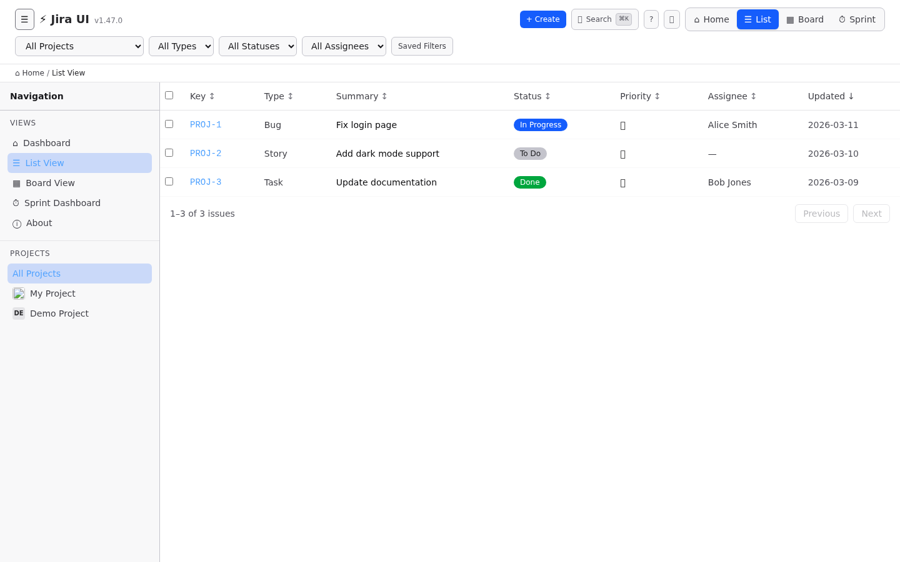
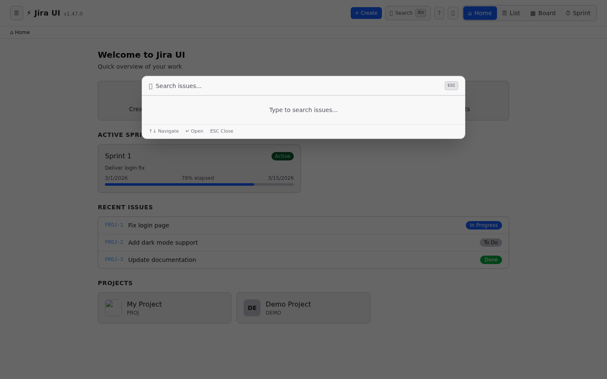
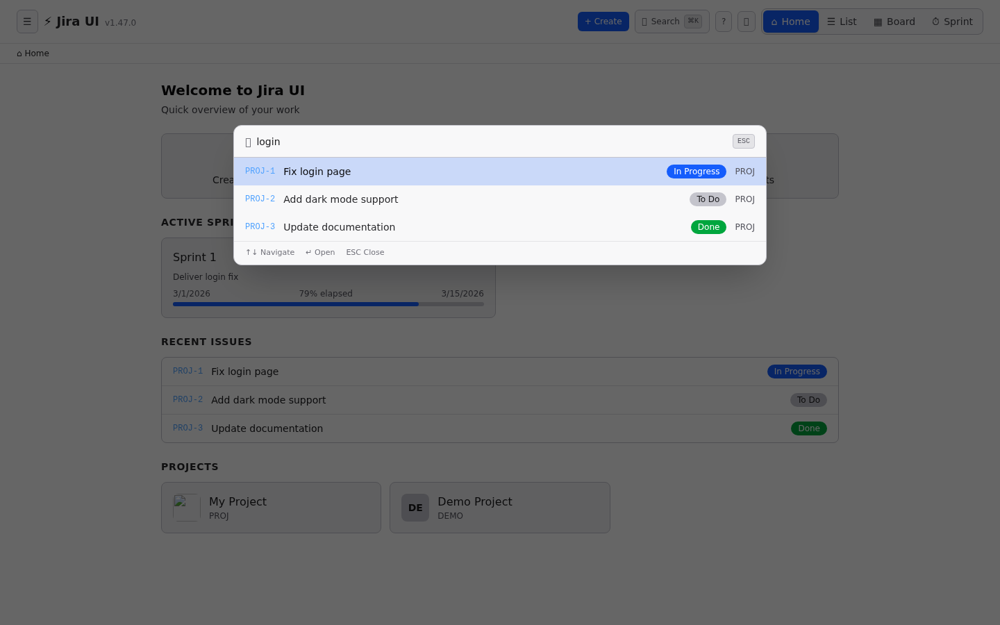
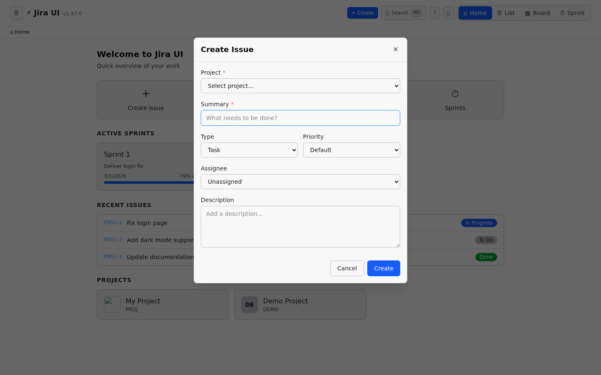
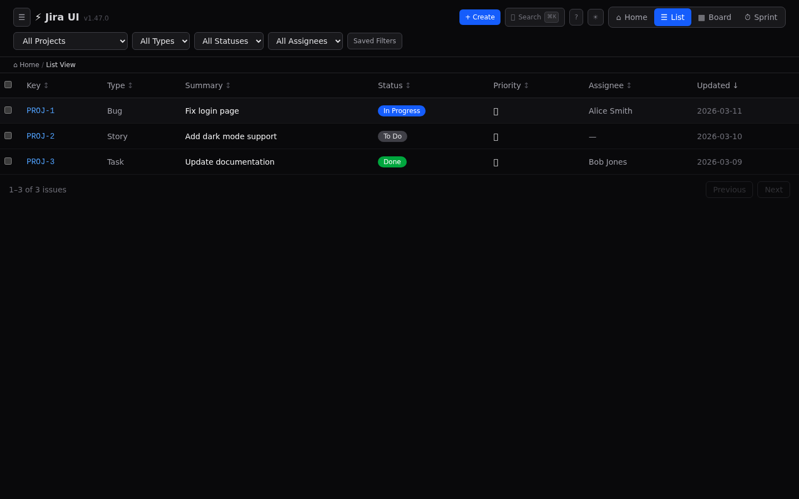
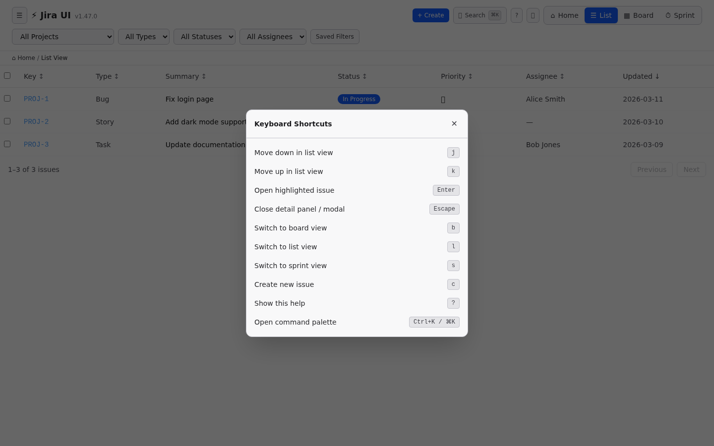
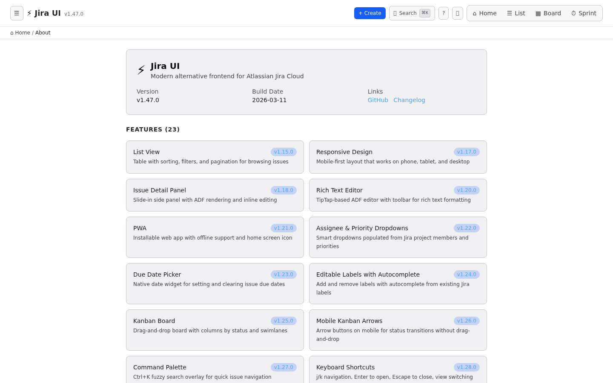
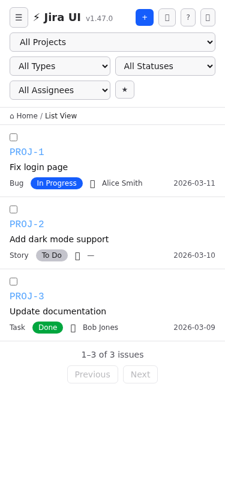
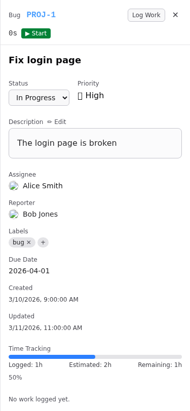

# Atlassian Jira UI — Application Screenshots

> Screenshots captured automatically using Playwright E2E tests with mock data.
> All views shown use mocked Jira API responses — no real data is displayed.

---

## 1. Issue List (Default View)

The main view shows all issues in a sortable, filterable table with status badges, priority indicators, and assignee avatars.


---

## 2. Issue Detail Panel

Click any issue to open a slide-in detail panel showing the full description (rendered from Jira ADF via TipTap), status transitions, assignee, priority, labels, time tracking, and more.


---

## 3. Sidebar Navigation

The collapsible sidebar provides quick access to views (Dashboard, List, Board, Sprint Dashboard, About) and project switching with Jira project avatars.



---

## 4. Dashboard

The landing dashboard shows active sprints, recent issues, and project cards for quick navigation.


---

## 5. Command Palette (Empty)

Press `⌘K` / `Ctrl+K` or click the search button to open the command palette. Shows recent searches when empty.



---

## 6. Command Palette (Search Results)

Type to search across all issues with debounced fuzzy matching. Results show issue key, summary, status, and project.



---

## 7. Create Issue Modal

Press `C` or click "+ Create" to open the quick-create modal with project, summary, type, priority, assignee, and rich text description fields.



---

## 8. Light Mode

Full light mode with WCAG AA compliant contrast ratios. Toggle via the 🌙/☀️ button in the header.



---

## 9. Keyboard Shortcuts

Press `?` to view all available keyboard shortcuts. The app supports full keyboard navigation.



---

## 10. About Page

Shows app version, build info, features list with version history, and links to the GitHub repository.



---

## 11. Mobile — Issue List

Fully responsive layout on mobile (375px). The sidebar collapses to a hamburger menu, columns adapt, and touch targets are optimized.



---

## 12. Mobile — Issue Detail

The detail panel adapts to full-width on mobile with stacked layout for metadata fields.



---

## How These Screenshots Were Generated

These screenshots are captured automatically by a Playwright test script (`frontend/e2e/screenshots.spec.ts`) using mocked API data. To regenerate:

```bash
cd frontend
npm run build
npx playwright test e2e/screenshots.spec.ts
```

Screenshots are saved to `docs/screenshots/`.
