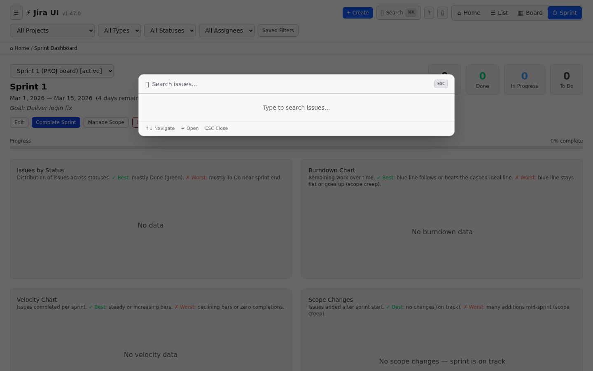
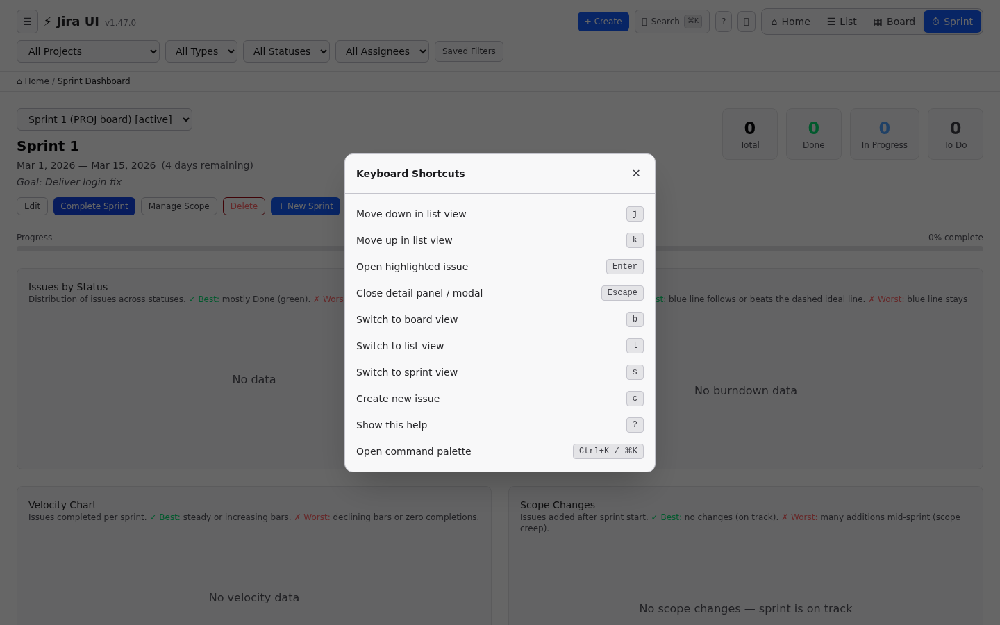
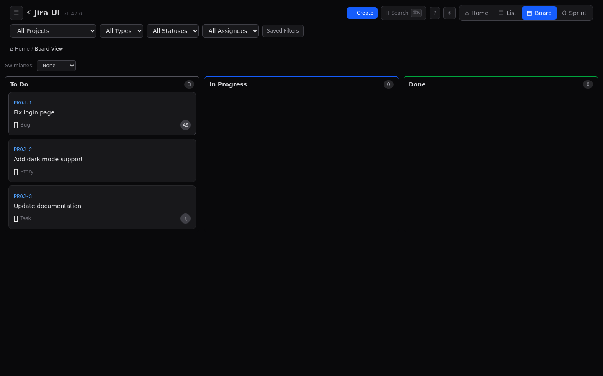
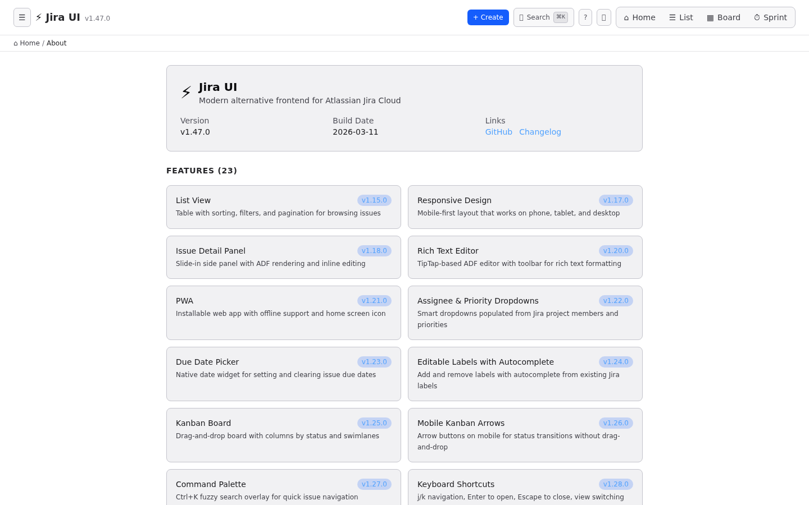
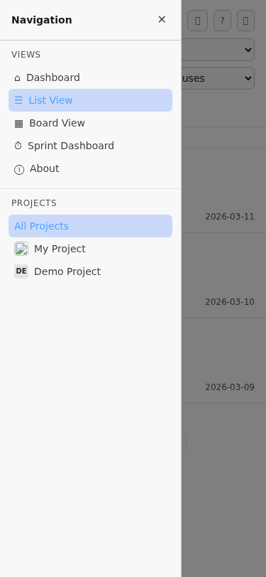

# Atlassian Jira UI — Application Screenshots

> Screenshots captured automatically using Playwright E2E tests with mock data.
> All views shown use mocked Jira API responses — no real data is displayed.

---

## Desktop Views

### 1. Issue List (Default View)

The main view shows all issues in a sortable, filterable table with status badges, priority indicators, and assignee avatars. Filter dropdowns for Type, Status, and Assignee sit above the table.


---

### 2. Issue Detail Panel

Click any issue to open a slide-in detail panel showing the full description (rendered from Jira ADF via TipTap), status transitions, assignee, priority, labels, time tracking, and more.


---

### 3. Sidebar Navigation

The collapsible sidebar provides quick access to views (Dashboard, List, Board, Sprint Dashboard, About) and project switching with Jira project avatars.


---

### 4. Dashboard

The landing dashboard shows active sprints, recent issues, quick actions, and project cards for navigation.


---

### 5. Kanban Board

Drag-and-drop board view with columns per status (To Do, In Progress, Done). Supports swimlanes by assignee or priority, and touch gestures on mobile.


---

### 6. Sprint Dashboard

Full sprint management with burndown chart, velocity chart, sprint progress overview, issue list, and sprint CRUD (create, start, complete, edit, delete).


---

### 7. Command Palette (Empty)

Press `⌘K` / `Ctrl+K` or click the search button to open the command palette. Shows recent searches when empty.



---

### 8. Command Palette (Search Results)

Type to search across all issues with debounced fuzzy matching. Results show issue key, summary, status, and project.


---

### 9. Create Issue Modal

Press `C` or click "+ Create" to open the quick-create modal with project, summary, type, priority, assignee, and rich text description fields.


---

### 10. Keyboard Shortcuts

Press `?` to view all available keyboard shortcuts. The app supports full keyboard navigation including vim-style j/k movement.



---

### 11. Light Mode — Issue List

Full light mode with WCAG AA compliant contrast ratios. Toggle via the 🌙/☀️ button in the header. CSS custom properties flip the entire zinc palette.


---

### 12. Light Mode — Kanban Board

The board view in light mode with the same column layout and drag-and-drop functionality.



---

### 13. About Page

Shows app version, build info, full feature list with version history, and links to the GitHub repository.



---

## Mobile Views (375px)

### 14. Mobile — Issue List

Fully responsive layout on mobile. The sidebar collapses to a hamburger menu, columns adapt, and touch targets are optimized.


---

### 15. Mobile — Issue Detail

The detail panel adapts to full-width on mobile with stacked layout for metadata fields.


---

### 16. Mobile — Sidebar

The sidebar slides in as an overlay on mobile with backdrop, showing all navigation options.



---

### 17. Mobile — Kanban Board

Board view on mobile with horizontal scroll and arrow navigation between status columns.


---

## How These Screenshots Were Generated

These screenshots are captured automatically by a Playwright test script (`frontend/e2e/screenshots.spec.ts`) using mocked API data. To regenerate:

```bash
cd frontend
npm run build
npx playwright test e2e/screenshots.spec.ts
```

Screenshots are saved to `docs/screenshots/` (17 images, ~1.2MB total).
