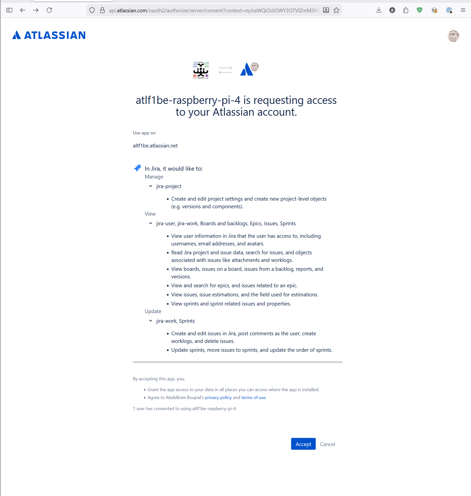
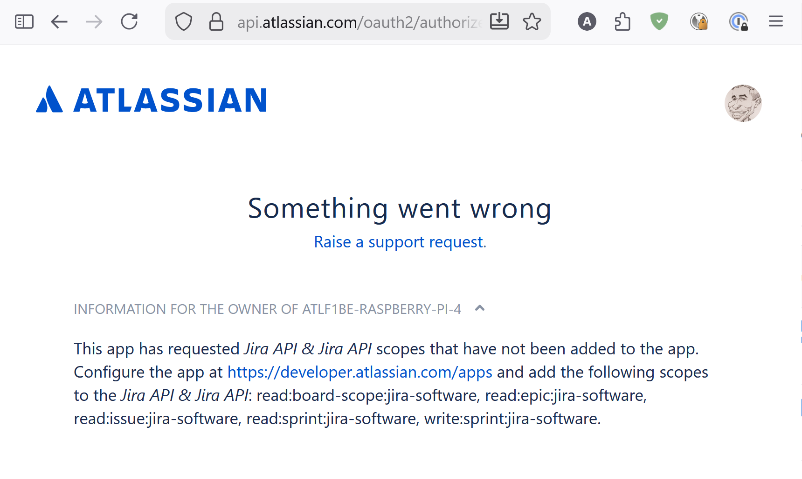

# User Guide

A modern, fast alternative UI for Atlassian Jira Cloud.

## Getting Started

### Access

| Environment | URL |
|---|---|
| Production | `https://atlf1be-raspberry-pi-4.tail981e59.ts.net:4443` |
| Development | `https://atlf1be-raspberry-pi-4.tail981e59.ts.net:9443` |

### Authentication

The app supports two authentication methods:

#### API Token (Current)

Your personal Jira API token is stored on the server. All API calls use your identity.

1. Go to **Settings** (⚙ in the sidebar)
2. Enter your **Jira Host** (e.g., `https://yourcompany.atlassian.net`)
3. Enter your **Email** (your Atlassian account email)
4. Enter your **API Token** — generate one at [id.atlassian.com/manage-profile/security/api-tokens](https://id.atlassian.com/manage-profile/security/api-tokens)
5. Click **🔌 Test Connection** to verify
6. Click **💾 Save Changes**

#### OAuth 2.0 — Login with Atlassian (New)

Each user logs in with their own Atlassian account. No shared credentials.

1. Click the **Login** button in the top-right header
2. You'll be redirected to Atlassian's consent screen showing:
   - **"atlf1be-raspberry-pi-4 is requesting access to your Atlassian account"**
   - **Manage**: jira-project — create/edit project settings and project-level objects
   - **View**: jira-user, jira-work — view user info, read project/issue data, search issues
   - **Update**: jira-work — create/edit issues, post comments, create worklogs, delete issues
   

   The consent screen shows all permissions grouped by action:

   **Manage:**
   - `jira-project` — Create and edit project settings and project-level objects

   **View:**
   - `jira-user` — View user information (usernames, email, avatars)
   - `jira-work` — Read project and issue data, search issues, attachments, worklogs
   - `Boards and backlogs` — View boards, issues on boards, backlogs, reports, versions
   - `Epics` — View and search epics and related issues
   - `Issues` — View issues, estimations, and estimation fields
   - `Sprints` — View sprints, sprint issues, and properties

   **Update:**
   - `jira-work` — Create/edit issues, post comments, create worklogs, delete issues
   - `Sprints` — Update sprints, move issues to sprints, reorder sprints

3. Click **Accept** to authorize
4. You'll be redirected back — your avatar and name appear in the header
5. Click **↪** to logout

> **Note:** If Firefox shows a certificate warning on redirect, click **"Advanced" → "Accept the Risk and Continue"**. This happens because the app uses Tailscale TLS certificates which Firefox doesn't trust by default. Fix permanently: go to `about:config` → set `security.enterprise_roots.enabled` to `true`.

> **Note:** If you see a "429 Too Many Requests" error on the consent page, wait 5 minutes — Atlassian rate-limits authorization requests. Only click Login once.

---

## Views

### Dashboard (⌂ Home)

The landing page shows:
- **Quick actions** — Create issue, Open search
- **Active sprints** — Current sprint status across projects
- **Recent issues** — Last 5 updated issues
- **Project cards** — All your Jira projects with avatars

### List View (☰)

A dense, sortable table of issues. Columns: Key, Type, Summary, Status, Priority, Assignee, Updated.

**Features:**
- Click any column header to sort (ascending/descending)
- Use the **filter dropdowns** to narrow by Type, Status, or Assignee — type to search!
- Select a **project** from the project dropdown (also searchable)
- Click any row to open the issue detail panel
- Click **↗** next to an issue key to open it directly in Jira
- **Pagination** at the bottom (50 issues per page)

### Board View (▦ Kanban)

Issues displayed as cards in status columns (To Do → In Progress → Done).

**Features:**
- **Drag and drop** cards between columns to change status
- **Swimlanes** — group by Assignee or Priority (dropdown in header)
- **Mobile**: use **← →** arrow buttons on cards (drag isn't practical on small screens)
- Click a card to open issue detail
- **↗** on each card opens it in Jira

### Sprint Dashboard (⏱)

Active sprint overview with charts and metrics.

**Features:**
- **Sprint selector** — type to search and filter sprints by name
- **Status pie chart** — To Do / In Progress / Done breakdown
- **Burndown chart** — remaining work vs ideal line
- **Velocity chart** — committed vs completed across sprints
- **Sprint actions**: Start, Complete, Edit, Delete, Manage Scope
- **Manage Scope** — add/remove issues from the sprint (click issue keys to view details)

### About (ⓘ)

App info, version, feature list, and tech stack.

### Settings (⚙)

Configure Jira connection, OAuth credentials, and view app preferences.

---

## Key Features

### Create Issue / Project

Click **+ Create** in the header to see a dropdown:
- **📋 Issue** — Create a new Jira issue (project, summary, type, priority, assignee, description)
- **📁 Project** — Create a new Jira project (name, auto-generated key, type, lead, description)

**Keyboard shortcut**: Press `c` to quickly open the Create Issue modal.

### Searchable Dropdowns

All dropdowns support **type-to-filter**:
- Start typing to narrow options
- Arrow keys ↑↓ to navigate
- Enter to select
- Escape to close

### Rich Text Editor

Issue descriptions use a full rich text editor (TipTap):
- **Bold** (Ctrl+B), **Italic** (Ctrl+I), ~~Strikethrough~~
- Headings (H1, H2, H3)
- Bullet lists, Numbered lists
- Links, Code blocks
- Click **Edit** on any issue description to modify

### Quick Search / Command Palette

Press `Ctrl+K` (or `Cmd+K` on Mac) to open the command palette:
- Type to search across all issues
- Arrow keys to navigate results
- Enter to open an issue
- Recent searches are saved

### Keyboard Shortcuts

Press `?` to see all shortcuts:

| Key | Action |
|-----|--------|
| `j` / `k` | Navigate up/down in list |
| `Enter` | Open selected issue |
| `Escape` | Close panel/modal |
| `b` | Switch to Board view |
| `l` | Switch to List view |
| `s` | Switch to Sprint view |
| `d` | Switch to Dashboard |
| `c` | Create new issue |
| `Ctrl+K` | Open command palette |
| `?` | Show shortcut help |

### Bulk Actions

In List view:
1. Check the boxes next to issues (or use the header checkbox for "select all")
2. A floating action bar appears at the bottom
3. Choose: **Transition** (change status), **Assign** (change assignee), or **Priority** (change priority)
4. Action applies to all selected issues at once

### Saved Filters

1. Apply filters (type, status, assignee, project)
2. Click **Save Filter** (appears when filters are active)
3. Name your filter
4. Access saved filters from the dropdown — click to apply instantly
5. Rename or delete filters inline

### Time Tracking

In the issue detail panel:
- **Timer** next to the issue key — click ▶ Start to begin tracking
- **Pause** / **Stop** the timer
- **Log Work** button to manually log time
- **Time tracking bar** shows logged vs estimated progress
- **Worklog history** at the bottom

### Dark / Light Mode

Click ☀️ / 🌙 in the header to toggle. Your preference is saved.

### Offline Mode

The app works offline:
- Previously loaded data is cached in your browser
- New issues/edits are queued and synced when you reconnect
- An offline banner appears when disconnected

### Open in Jira

Every issue has a **↗** link that opens the corresponding page directly in Jira. Available in:
- List view (next to issue key)
- Board cards
- Issue detail panel header

---

## Sidebar Navigation

Click the **☰** button (top-left) to open the sidebar:
- **Projects** — click to filter by project
- **Saved Filters** — quick access to saved filter combinations
- **Views** — Dashboard, List, Board, Sprint, About, Settings

---

## Tips

- **Project filter persists** — selecting a project in the header filters all views
- **Clear filters** button appears when any filter is active
- **Right-click ↗** to open Jira in a new tab while staying in the app
- **PWA install** — on mobile, use "Add to Home Screen" for an app-like experience
- The app is **fully responsive** — works on phone, tablet, and desktop

---

## Troubleshooting

### "Failed to load" errors
- Check your internet connection
- Verify Jira credentials in Settings → Test Connection
- If using API Token: make sure it hasn't expired

### Login redirects back with error
- Ensure the callback URL in your Atlassian Developer Console matches: `https://your-host:port/auth/callback`
- Check that required scopes are enabled: `read:jira-work`, `write:jira-work`, `read:jira-user`

### "Something went wrong — scopes not added to the app"

If you see this error from Atlassian:

> *This app has requested Jira API & Jira API scopes that have not been added to the app. Configure the app at https://developer.atlassian.com/apps and add the following scopes to the Jira API & Jira API: read:board-scope:jira-software, read:epic:jira-software, read:issue:jira-software, read:sprint:jira-software, write:sprint:jira-software.*

**How to fix:**
1. Go to [developer.atlassian.com/console/myapps](https://developer.atlassian.com/console/myapps)
2. Open your app → **Permissions**
3. Find **"Jira API"** (not "Jira platform") → click **Edit Scopes** or **Configure**
4. You need to add **two separate products** in Permissions:

   **Product 1: Jira API** (Jira platform) — click "Edit Scopes":
   | Scope | Purpose |
   |-------|---------|
   | `read:jira-work` | Read issues, projects, boards |
   | `write:jira-work` | Create/edit issues, transitions |
   | `manage:jira-project` | Create/edit projects |
   | `read:jira-user` | Read user profiles |

   **Product 2: Jira Software** — click **"+ Add"** to add this product, then "Edit Scopes":
   | Scope | Purpose |
   |-------|---------|
   | `read:board-scope:jira-software` | View boards and backlogs |
   | `read:sprint:jira-software` | View sprints |
   | `write:sprint:jira-software` | Manage sprints |
   | `read:issue:jira-software` | View issues on boards |
   | `read:epic:jira-software` | View epics |

5. **Save** the changes for both products
6. **Logout (↪) and Login again** to get a fresh token with all scopes

> **Important:** "Jira API" and "Jira Software" are **two separate products** in the Developer Console. You must add both. If you only see "Jira API", click the **"+ Add"** button to add "Jira Software" as a second product.

### Issue not updating
- The app caches data for performance. Click the browser refresh button to force a fresh load
- Static data (projects, priorities) is cached for 30 min
- Issue lists refresh every 2 min
- Single issue details refresh every 1 min

---

---

## Technologies

| Technology | Purpose | URL |
|---|---|---|
| [React 19](https://react.dev/) | Frontend UI framework | <https://react.dev/> |
| [TypeScript 5.7](https://www.typescriptlang.org/) | Type-safe JavaScript | <https://www.typescriptlang.org/> |
| [Vite](https://vite.dev/) | Frontend build tool + dev server | <https://vite.dev/> |
| [Tailwind CSS 4](https://tailwindcss.com/) | Utility-first CSS framework | <https://tailwindcss.com/> |
| [TanStack Query](https://tanstack.com/query) | Data fetching + caching | <https://tanstack.com/query> |
| [TipTap](https://tiptap.dev/) | Rich text editor (ProseMirror) | <https://tiptap.dev/> |
| [Recharts](https://recharts.org/) | Charts (burndown, velocity, pie) | <https://recharts.org/> |
| [dnd-kit](https://dndkit.com/) | Drag-and-drop (Kanban board) | <https://dndkit.com/> |
| [Playwright](https://playwright.dev/) | E2E browser testing | <https://playwright.dev/> |
| [Vitest](https://vitest.dev/) | Unit testing framework | <https://vitest.dev/> |
| [FastAPI](https://fastapi.tiangolo.com/) | Backend Python framework | <https://fastapi.tiangolo.com/> |
| [Python 3.13](https://www.python.org/) | Backend language | <https://www.python.org/> |
| [httpx](https://www.python-httpx.org/) | Async HTTP client for Jira API | <https://www.python-httpx.org/> |
| [Pydantic](https://docs.pydantic.dev/) | Request/response validation | <https://docs.pydantic.dev/> |
| [Docker](https://www.docker.com/) | Containerization | <https://www.docker.com/> |
| [Traefik](https://traefik.io/) | Reverse proxy + TLS termination | <https://traefik.io/> |
| [Watchtower](https://github.com/nicholas-fedor/watchtower) | Auto-update Docker containers | <https://github.com/nicholas-fedor/watchtower> |
| [Tailscale](https://tailscale.com/) | VPN + TLS certificates | <https://tailscale.com/> |
| [GitHub Actions](https://github.com/features/actions) | CI/CD pipelines | <https://github.com/features/actions> |
| [GHCR](https://ghcr.io/) | Docker image registry | <https://ghcr.io/> |
| [Jira Cloud REST API v3](https://developer.atlassian.com/cloud/jira/platform/rest/v3/intro/) | Jira data source | <https://developer.atlassian.com/cloud/jira/platform/rest/v3/intro/> |
| [Jira Agile REST API](https://developer.atlassian.com/cloud/jira/software/rest/intro/) | Boards, sprints, epics | <https://developer.atlassian.com/cloud/jira/software/rest/intro/> |
| [Atlassian OAuth 2.0 (3LO)](https://developer.atlassian.com/cloud/jira/platform/oauth-2-3lo-apps/) | User authentication | <https://developer.atlassian.com/cloud/jira/platform/oauth-2-3lo-apps/> |

---

Built by [ALT-F1](https://www.alt-f1.be) · Brussels 🇧🇪 🇲🇦
